# Akcan AI E-Ticaret Platformu

Bu proje, Spring Boot tabanlı, PostgreSQL veritabanı kullanan, modern ve güvenli bir e-ticaret platformudur. Kullanıcılar ürünleri inceleyebilir, sepet oluşturabilir, sipariş verebilir, hesaplarını yönetebilir ve yapay zeka destekli asistan ile alışveriş deneyimlerini geliştirebilirler. Yönetici paneli ile ürün, kategori, kullanıcı ve sipariş yönetimi yapılabilir.

---

## İçerik

- [Teknolojiler](#teknolojiler)
- [Kurulum](#kurulum)
- [Kullanım](#kullanım)
- [Özellikler](#özellikler)
- [Backend Mimarisi](#backend-mimarisi)
- [Ekran Görüntüleri](#ekran-görüntüleri)

---

## Teknolojiler

- **Backend:** Java 17, Spring Boot 3, Spring Data JPA, Spring Security, Spring Mail
- **Veritabanı:** PostgreSQL
- **Frontend:** Thymeleaf, HTML5, CSS3, JavaScript
- **Diğer:** Maven, Lombok, BCrypt, E-posta servisi

---

## Kurulum

1. **Projeyi klonlayın:**
   ```bash
   git clone <repo-linkinizi-buraya-yazın>
   cd bitirmeFinal-main
   ```

2. **Veritabanı ayarlarını yapın:**  
   `bitirmeProjemFinal/src/main/resources/application.properties` dosyasında PostgreSQL bağlantı bilgilerinizi girin.

3. **Java ve Maven kurulu olmalı.**  
   Java 17+ ve Maven gereklidir.

4. **Projeyi başlatın:**
   ```bash
   cd bitirmeProjemFinal
   mvn spring-boot:run
   ```

5. **Uygulamayı açın:**  
   Tarayıcınızda `http://localhost:8080` adresine gidin.

---

## Kullanım

- **Kayıt Ol / Giriş Yap:** Kullanıcılar kayıt olabilir veya giriş yapabilir.
- **Ürünleri İnceleyin:** Kategorilere göre ürünleri görüntüleyin, arayın ve filtreleyin.
- **Sepet ve Sipariş:** Ürünleri sepete ekleyin, sepeti yönetin ve sipariş oluşturun.
- **Profil Yönetimi:** Kullanıcılar profil bilgilerini ve şifrelerini güncelleyebilir.
- **Şifre Sıfırlama:** E-posta ile şifre sıfırlama işlemi yapılabilir.
- **Sipariş Takibi:** Kullanıcılar geçmiş siparişlerini görebilir.
- **Yönetici Paneli:** Yöneticiler ürün, kategori, kullanıcı ve sipariş yönetimi yapabilir.
- **Akcan AI Asistanı:** `/akcan-ai` sayfasında yapay zeka asistanı ile sohbet ederek ürün önerileri alınabilir.

---

## Özellikler

### Kullanıcı Tarafı
- Kayıt olma, giriş yapma, profil ve şifre yönetimi
- Ürünleri kategoriye göre listeleme, arama ve filtreleme
- Sepete ürün ekleme, sepeti güncelleme ve sipariş oluşturma
- Sipariş geçmişini görüntüleme
- Şifre sıfırlama (e-posta ile)
- Akcan AI ile sohbet ve ürün önerisi alma

### Yönetici Tarafı
- Ürün ekleme, düzenleme, silme
- Kategori yönetimi
- Kullanıcı yönetimi (hesap durumu güncelleme)
- Sipariş yönetimi ve sipariş durumu güncelleme
- Yönetici ekleme

### Genel
- E-posta ile bildirimler (şifre sıfırlama, sipariş işlemleri)
- Güvenli giriş ve rol bazlı erişim (Spring Security)
- Modern, mobil uyumlu ve kullanıcı dostu arayüz

---

## Backend Mimarisi

- **Katmanlar:**
  - `controller`: HTTP isteklerini karşılayan, yönlendirme ve iş akışını yöneten sınıflar
  - `service`: İş mantığı ve veri işleme katmanı
  - `repository`: JPA ile veritabanı işlemleri
  - `entity`: Veritabanı tablolarını temsil eden model sınıfları
  - `config`: Güvenlik ve uygulama yapılandırmaları
  - `util`: Ortak yardımcı sınıflar (ör. e-posta gönderimi, şifreleme)

- **Başlıca Entity’ler:**
  - `UserDtls`: Kullanıcı bilgileri ve hesap yönetimi
  - `Product`: Ürün bilgileri
  - `Category`: Ürün kategorileri
  - `Cart`: Sepet ve ürün ilişkisi
  - `ProductOrder`: Siparişler ve sipariş detayları
  - `OrderAddress`: Sipariş adresi bilgileri

- **Güvenlik:**
  - Spring Security ile kullanıcı ve yönetici rolleri
  - BCrypt ile şifreleme
  - Hesap kilitleme ve başarısız giriş denemesi takibi

- **E-posta Servisi:**
  - Spring Mail ile şifre sıfırlama ve sipariş bildirimleri

- **Veritabanı:**
  - PostgreSQL üzerinde JPA ile CRUD işlemleri

---

## Ekran Görüntüleri

Ana Sayfa:

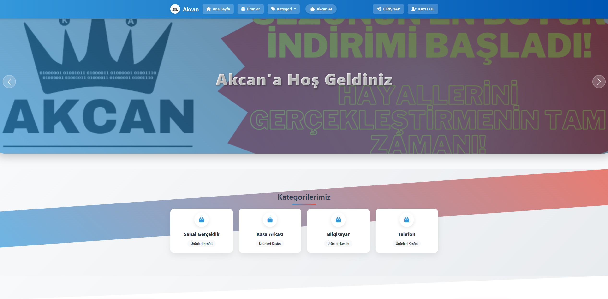

Ana Sayfa Alt Kısmı:

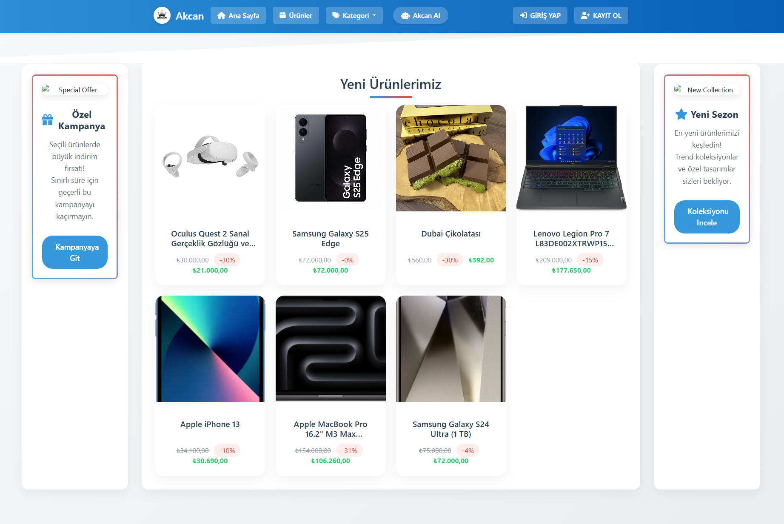

Giriş Yap:

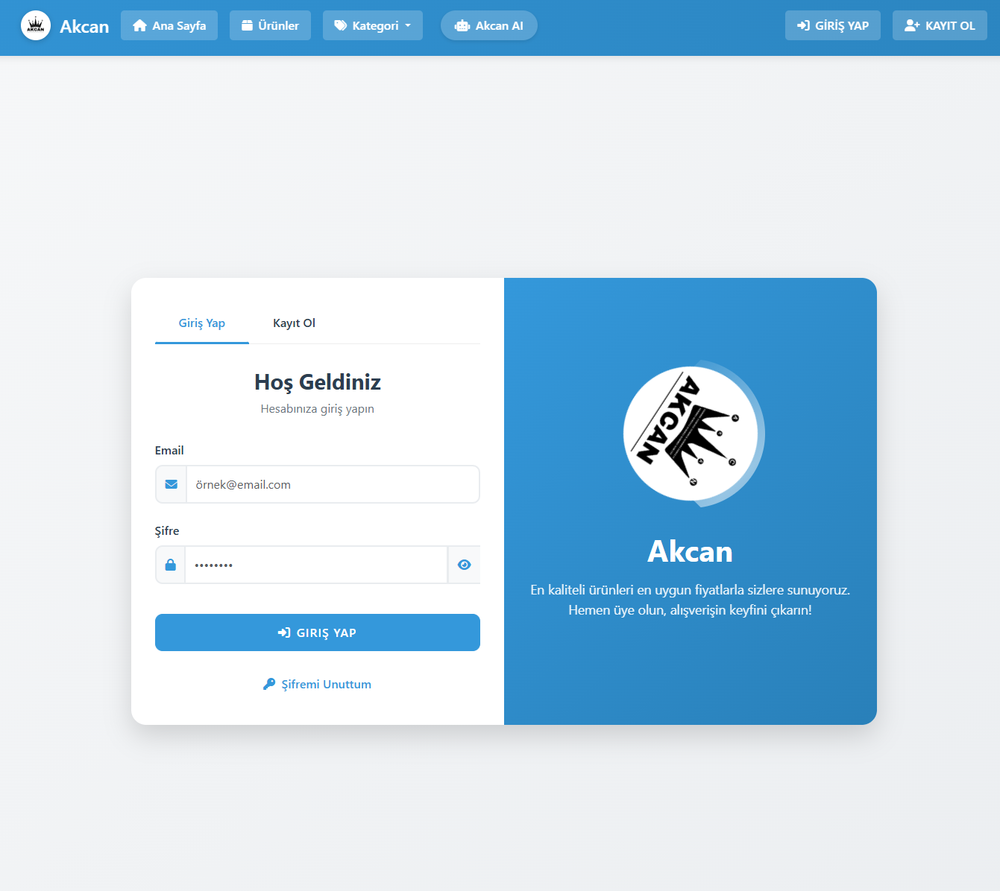

Profil:

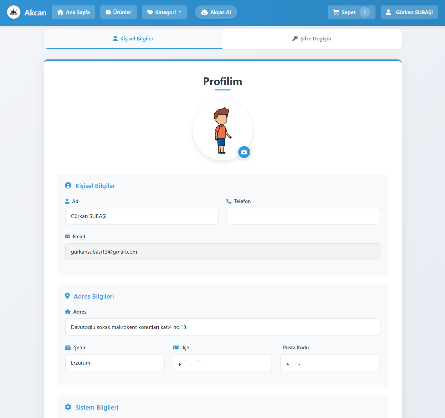

Şifre Değiştir:

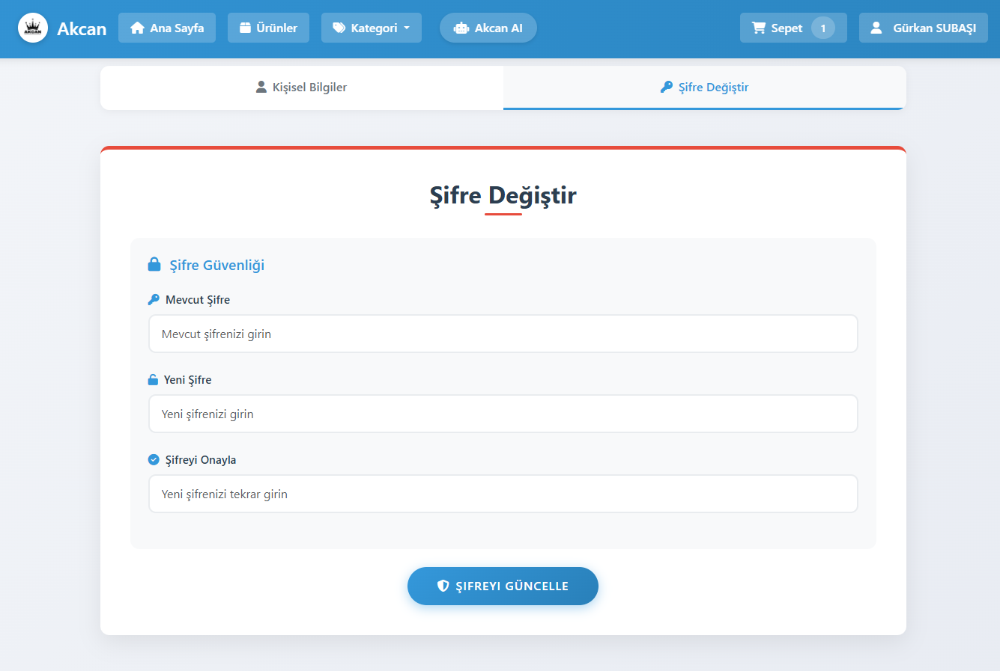

Siparişlerim:

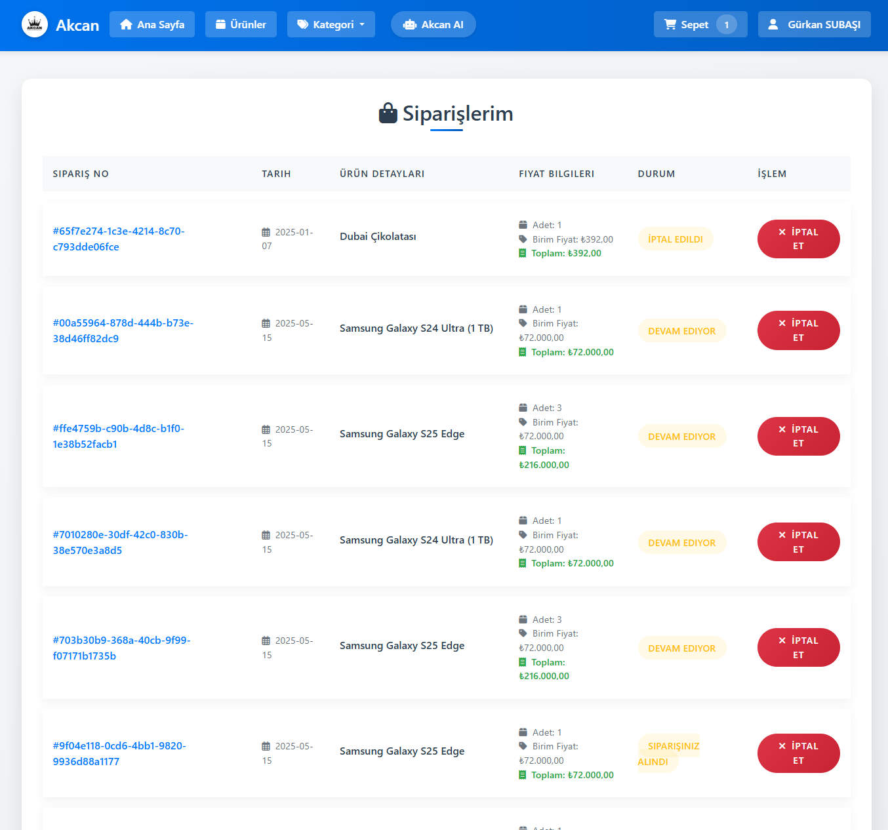

Ürünler:

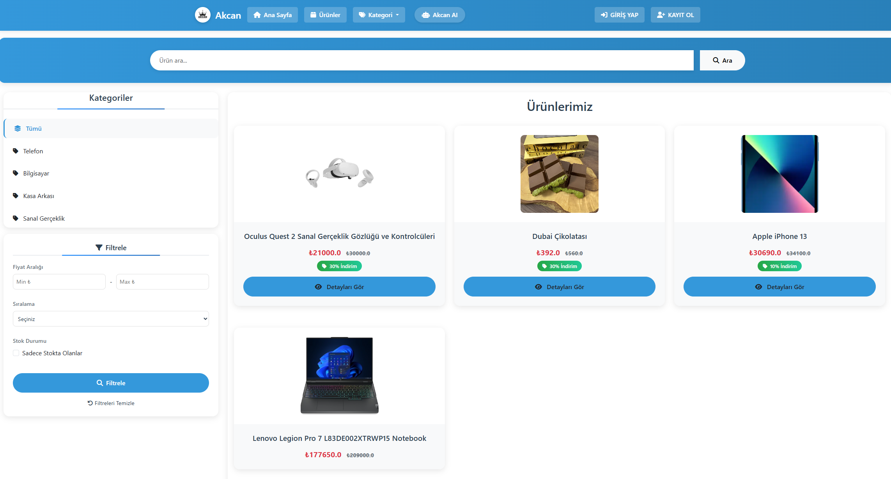

Akcan AI Asistanı:

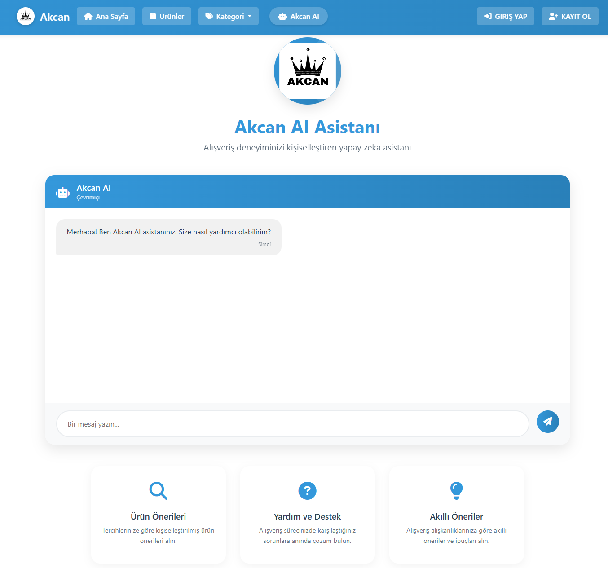

Admin Kontrol Paneli:

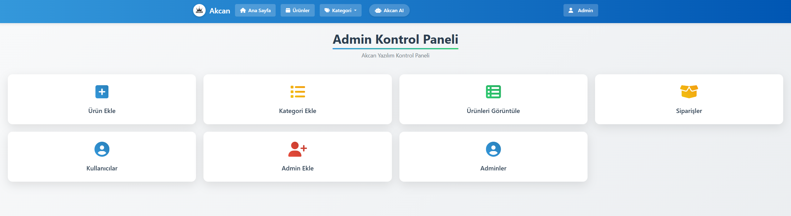

Admin Profil:

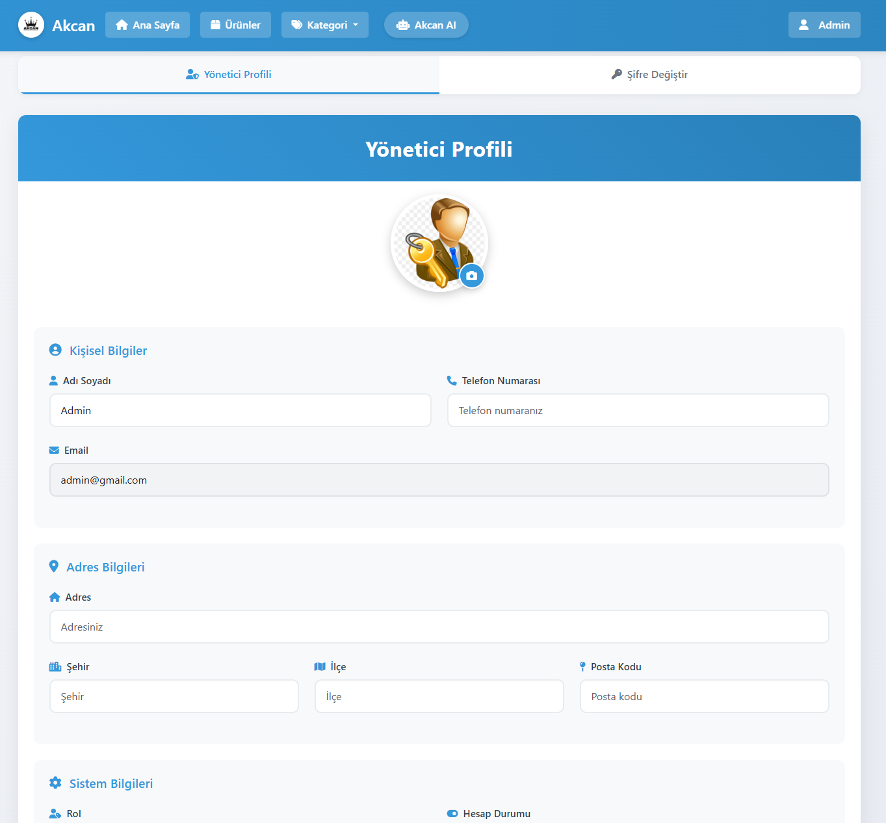

Admin Şifre Değiştir:

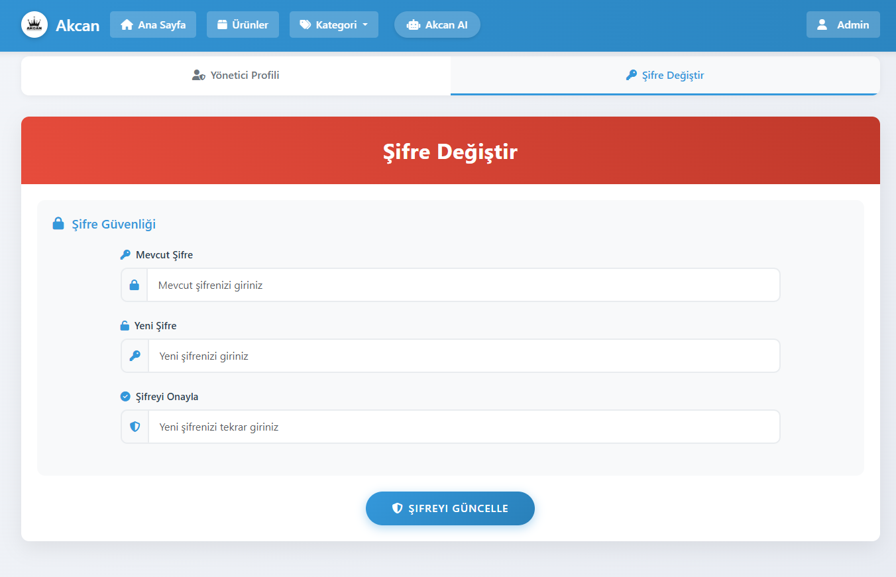

Admin Ekle:

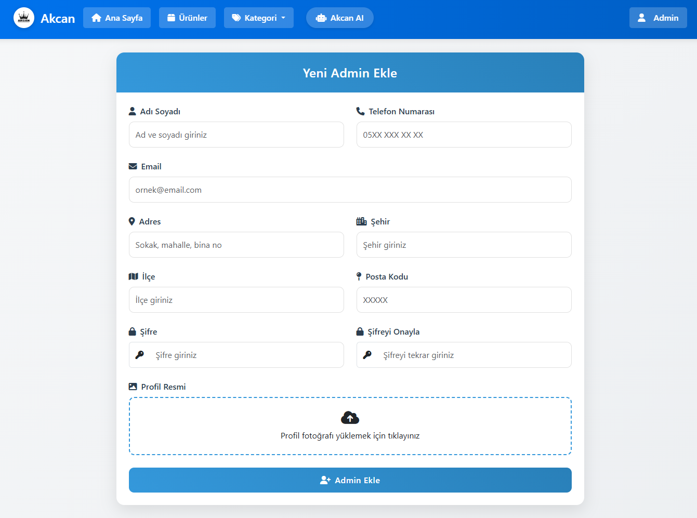

Kategori Ekle:

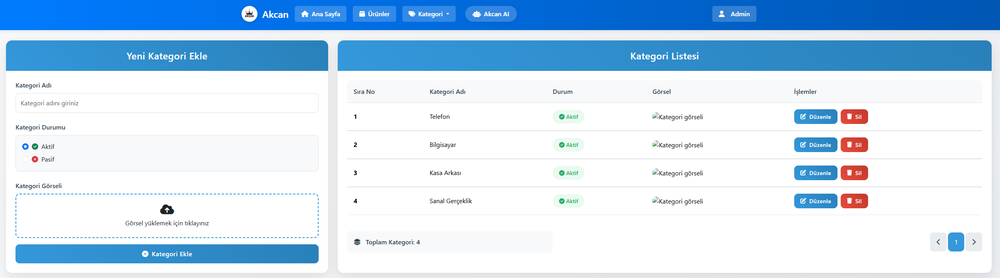

Sipariş Yönetimi:

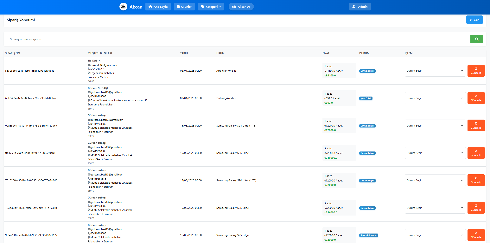

Ürün Ekle:

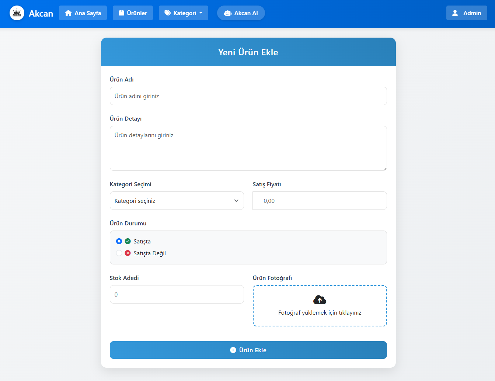

--- 

---

# Akcan AI E-Commerce Platform

This project is a modern, secure e-commerce platform built with Spring Boot and PostgreSQL. Users can browse products, create a cart, place orders, manage their accounts, and enhance their shopping experience with an AI-powered assistant. The admin panel allows for product, category, user, and order management.

---

## Contents

- [Technologies](#technologies)
- [Setup](#setup)
- [Usage](#usage)
- [Features](#features)
- [Backend Architecture](#backend-architecture)
- [Screenshots](#screenshots)

---

## Technologies

- **Backend:** Java 17, Spring Boot 3, Spring Data JPA, Spring Security, Spring Mail
- **Database:** PostgreSQL
- **Frontend:** Thymeleaf, HTML5, CSS3, JavaScript
- **Other:** Maven, Lombok, BCrypt, Email service

---

## Setup

1. **Clone the project:**
   ```bash
   git clone <your-repo-link>
   cd bitirmeFinal-main
   ```
2. **Configure your database:**  
   Enter your PostgreSQL credentials in `bitirmeProjemFinal/src/main/resources/application.properties`.
3. **Java 17+ and Maven must be installed.**
4. **Start the project:**
   ```bash
   cd bitirmeProjemFinal
   mvn spring-boot:run
   ```
5. **Open the application:**  
   Go to `http://localhost:8080` in your browser.

---

## Usage

- **Register / Login:** Users can register or log in.
- **Browse Products:** View, search, and filter products by category.
- **Cart and Orders:** Add products to cart, manage the cart, and place orders.
- **Profile Management:** Users can update their profile information and password.
- **Password Reset:** Reset password via email.
- **Order Tracking:** Users can view their order history.
- **Admin Panel:** Admins can manage products, categories, users, and orders.
- **Akcan AI Assistant:** Get product recommendations via the AI assistant at `/akcan-ai`.

---

## Features

### User Side
- Register, login, profile and password management
- List, search, and filter products by category
- Add to cart, update cart, and place orders
- View order history
- Password reset (via email)
- Chat with Akcan AI and get product recommendations

### Admin Side
- Add, edit, delete products
- Category management
- User management (update account status)
- Order management and status updates
- Add new admins

### General
- Email notifications (password reset, order updates)
- Secure login and role-based access (Spring Security)
- Modern, mobile-friendly, and user-friendly interface

---

## Backend Architecture

- **Layers:**
  - `controller`: Handles HTTP requests and application flow
  - `service`: Business logic and data processing
  - `repository`: Database operations with JPA
  - `entity`: Model classes representing database tables
  - `config`: Security and application configuration
  - `util`: Utility classes (e.g., email sending, encryption)

- **Main Entities:**
  - `UserDtls`: User information and account management
  - `Product`: Product information
  - `Category`: Product categories
  - `Cart`: Cart and product relationship
  - `ProductOrder`: Orders and order details
  - `OrderAddress`: Order address information

- **Security:**
  - User and admin roles with Spring Security
  - Password encryption with BCrypt
  - Account locking and failed login attempt tracking

- **Email Service:**
  - Password reset and order notifications with Spring Mail

- **Database:**
  - CRUD operations with JPA on PostgreSQL

---

